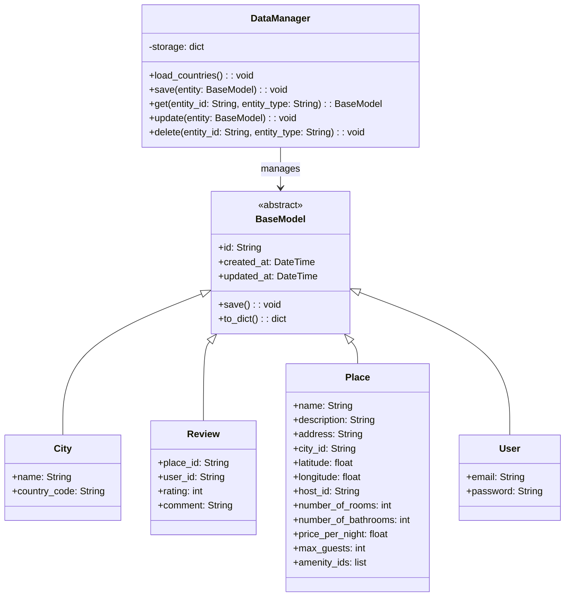

# HBnB Evolution Application

Este proyecto es una aplicación de gestión de lugares (places) basada en Flask, que incluye funcionalidades para gestionar usuarios, ciudades, países, revisiones y amenidades. La aplicación se puede ejecutar en un entorno Dockerizado usando Gunicorn como servidor de aplicaciones.

## Estructura del Proyecto

### Modelos

- **BaseModel**: Clase abstracta que define atributos y métodos comunes.
- **City**: Representa una ciudad.
- **DataManager**: Gestiona la persistencia de datos.
- **Review**: Representa una revisión.
- **Place**: Representa un lugar.
- **User**: Representa un usuario.

### Endpoints

#### Usuarios

- **POST /users**: Crear un nuevo usuario.
- **GET /users**: Obtener una lista de todos los usuarios.
- **GET /users/{user_id}**: Obtener detalles de un usuario específico.
- **PUT /users/{user_id}**: Actualizar un usuario existente.
- **DELETE /users/{user_id}**: Eliminar un usuario.

#### Ciudades

- **POST /cities**: Crear una nueva ciudad.
- **GET /cities**: Obtener una lista de todas las ciudades.
- **GET /cities/{city_id}**: Obtener detalles de una ciudad específica.
- **PUT /cities/{city_id}**: Actualizar una ciudad existente.
- **DELETE /cities/{city_id}**: Eliminar una ciudad.

#### Revisiones

- **POST /places/{place_id}/reviews**: Crear una nueva revisión para un lugar específico.
- **GET /users/{user_id}/reviews**: Obtener todas las revisiones escritas por un usuario específico.
- **GET /places/{place_id}/reviews**: Obtener todas las revisiones de un lugar específico.
- **GET /reviews/{review_id}**: Obtener detalles de una revisión específica.
- **PUT /reviews/{review_id}**: Actualizar una revisión existente.
- **DELETE /reviews/{review_id}**: Eliminar una revisión.

#### Amenidades

- **POST /amenities**: Crear una nueva amenidad.
- **GET /amenities**: Obtener una lista de todas las amenidades.
- **GET /amenities/{amenity_id}**: Obtener detalles de una amenidad específica.
- **PUT /amenities/{amenity_id}**: Actualizar una amenidad existente.
- **DELETE /amenities/{amenity_id}**: Eliminar una amenidad.

### Diagrama UML

#### Diagrama de Clases



#### Diagrama de Despliegue


## Pruebas Unitarias

### Pruebas de Usuarios

Archivo: `tests/test_user_endpoints.py`

### Pruebas de Ciudades

Archivo: `tests/test_country_city_endpoints.py`

### Pruebas de Revisiones

Archivo: `tests/test_review_endpoints.py`

## Dockerización

### `Dockerfile`

```dockerfile
# Utilizar una imagen base de Alpine Linux con Python
FROM python:3.9-alpine

# Establecer variables de entorno
ENV PYTHONDONTWRITEBYTECODE 1
ENV PYTHONUNBUFFERED 1
ENV PORT 8000

# Crear y establecer el directorio de trabajo
WORKDIR /app

# Instalar dependencias del sistema
RUN apk update && apk add postgresql-dev gcc python3-dev musl-dev

# Copiar el archivo de requerimientos
COPY requirements.txt /app/

# Instalar las dependencias de Python
RUN pip install --upgrade pip
RUN pip install -r requirements.txt

# Copiar el código fuente de la aplicación
COPY . /app/

# Exponer el puerto en el que correrá la aplicación
EXPOSE $PORT

# Crear un volumen para la persistencia de datos
VOLUME /app/data

# Configurar Gunicorn como el servidor de aplicaciones
CMD ["sh", "-c", "gunicorn --bind 0.0.0.0:${PORT} api.review_manager:app"]
```

### Construcción y Ejecución del Contenedor Docker

#### Construir la imagen

```sh
docker build -t my_flask_app .
```

#### Ejecutar el contenedor

```sh
docker run -d -p 8000:8000 --name my_flask_app_container -v $(pwd)/data:/app/data -e PORT=8000 my_flask_app
```

### Verificación

Para verificar que tu aplicación está funcionando correctamente, abre un navegador web y navega a `http://localhost:8000`. También puedes usar herramientas como `curl` o `Postman` para hacer peticiones a tus endpoints y verificar que están respondiendo correctamente.

#### Comando `curl` de ejemplo

```sh
curl http://localhost:8000/places
```

---
