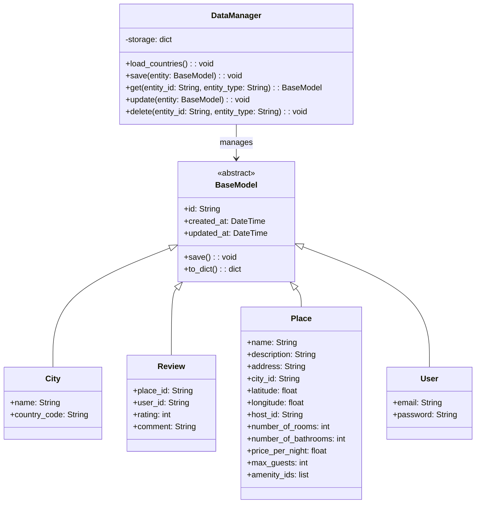

---
# HBnB Evolution Application

This project is a place management application based on Flask, which includes functionalities for managing users, cities, countries, reviews, and amenities. The application can be run in a Dockerized environment using Gunicorn as the application server.

## Project Structure

### Models

- **BaseModel**: Abstract class defining common attributes and methods.
- **City**: Represents a city.
- **DataManager**: Manages data persistence.
- **Review**: Represents a review.
- **Place**: Represents a place.
- **User**: Represents a user.

### Endpoints

#### Users
- **POST /users**: Create a new user.
- **GET /users**: Retrieve a list of all users.
- **GET /users/{user_id}**: Retrieve details of a specific user.
- **PUT /users/{user_id}**: Update an existing user.
- **DELETE /users/{user_id}**: Delete a user.

#### Cities
- **POST /cities**: Create a new city.
- **GET /cities**: Retrieve a list of all cities.
- **GET /cities/{city_id}**: Retrieve details of a specific city.
- **PUT /cities/{city_id}**: Update an existing city.
- **DELETE /cities/{city_id}**: Delete a city.

#### Reviews
- **POST /places/{place_id}/reviews**: Create a new review for a specific place.
- **GET /users/{user_id}/reviews**: Retrieve all reviews written by a specific user.
- **GET /places/{place_id}/reviews**: Retrieve all reviews for a specific place.
- **GET /reviews/{review_id}**: Retrieve details of a specific review.
- **PUT /reviews/{review_id}**: Update an existing review.
- **DELETE /reviews/{review_id}**: Delete a review.

#### Amenities
- **POST /amenities**: Create a new amenity.
- **GET /amenities**: Retrieve a list of all amenities.
- **GET /amenities/{amenity_id}**: Retrieve details of a specific amenity.
- **PUT /amenities/{amenity_id}**: Update an existing amenity.
- **DELETE /amenities/{amenity_id}**: Delete an amenity.

### UML Diagram

#### Class Diagram



#### Deployment Diagram


## Unit Tests

### User Tests

File: `tests/test_user_endpoints.py`

### City Tests

File: `tests/test_country_city_endpoints.py`

### Review Tests

File: `tests/test_review_endpoints.py`

## Dockerization

### `Dockerfile`

```dockerfile
# Use an Alpine Linux base image with Python
FROM python:3.9-alpine

# Set environment variables
ENV PYTHONDONTWRITEBYTECODE 1
ENV PYTHONUNBUFFERED 1
ENV PORT 8000

# Create and set the working directory
WORKDIR /app

# Install system dependencies
RUN apk update && apk add postgresql-dev gcc python3-dev musl-dev

# Copy the requirements file
COPY requirements.txt /app/

# Install Python dependencies
RUN pip install --upgrade pip
RUN pip install -r requirements.txt

# Copy the application source code
COPY . /app/

# Expose the port the application will run on
EXPOSE $PORT

# Create a volume for data persistence
VOLUME /app/data

# Configure Gunicorn as the application server
CMD ["sh", "-c", "gunicorn --bind 0.0.0.0:${PORT} api.review_manager:app"]
```

### Building and Running the Docker Container

#### Build the image

```sh
docker build -t my_flask_app .
```

#### Run the container

```sh
docker run -d -p 8000:8000 --name my_flask_app_container -v $(pwd)/data:/app/data -e PORT=8000 my_flask_app
```

### Verification

To verify that your application is working correctly, open a web browser and navigate to `http://localhost:8000`. You can also use tools like `curl` or Postman to make requests to your endpoints and verify that they are responding correctly.

#### Example `curl` command

```sh
curl http://localhost:8000/places
```

---